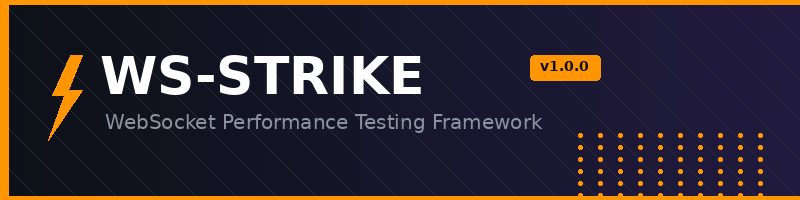
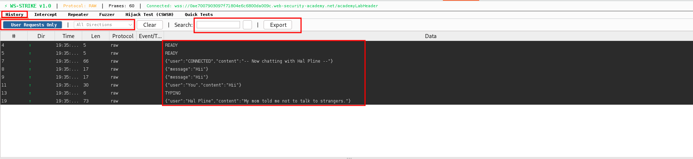
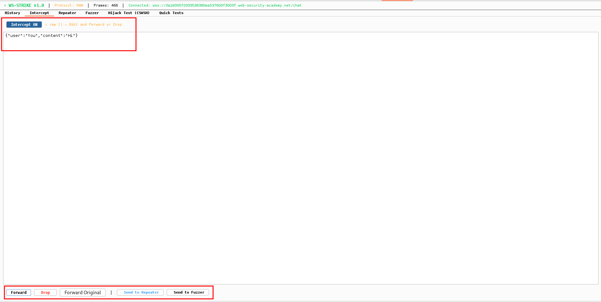
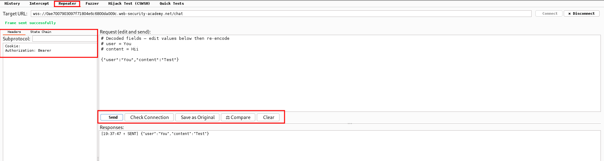
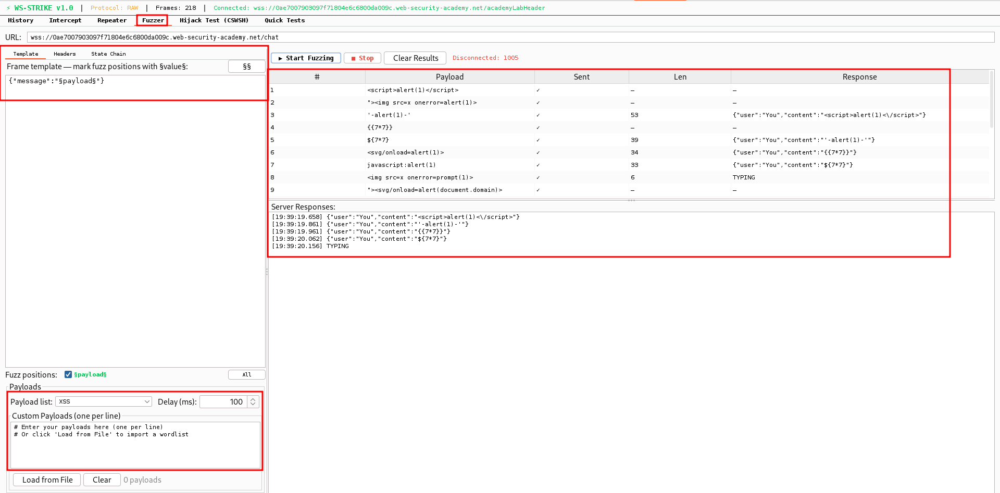
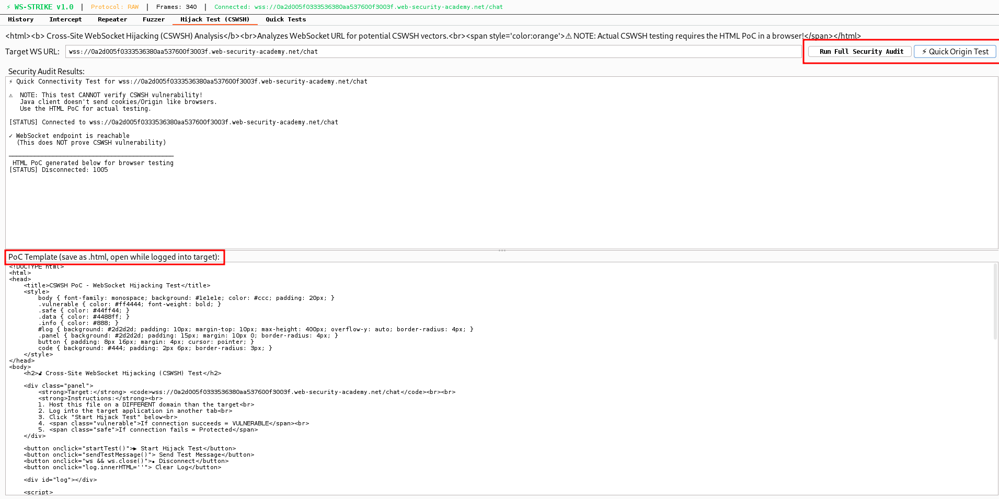
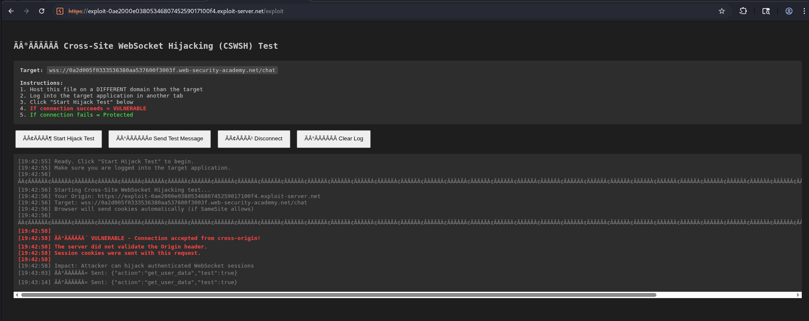
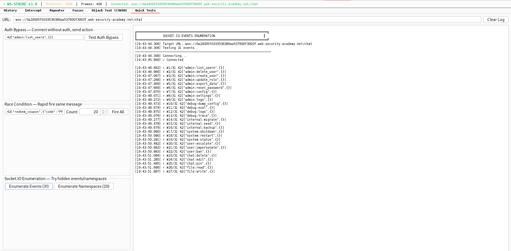

# WS-Strike

### WebSocket Penetration Testing Toolkit for Burp Suite

<p align="center">
  
</p>

<p align="center">
  <a href="#features">Features</a> •
  <a href="#installation">Installation</a> •
  <a href="#usage">Usage</a> •
  <a href="#protocols">Protocols</a> •
  <a href="#screenshots">Screenshots</a> •
  <a href="#security-testing">Security Testing</a>
</p>

<p align="center">
  
  
  
  
</p>

---

## Overview

**WS-Strike** is a comprehensive Burp Suite extension designed for WebSocket security testing. It provides professional-grade tools for intercepting, analyzing, fuzzing, and exploiting WebSocket communications across multiple protocols.

Built for penetration testers and security researchers who need robust WebSocket testing capabilities beyond Burp's native features.

## Features

### Core Capabilities

| Feature | Description |
|---------|-------------|
| **Multi-Protocol Support** | Socket.IO, SignalR, GraphQL-WS, Action Cable, STOMP, SockJS, Raw JSON |
| **Real-time Interception** | Intercept, modify, or drop WebSocket frames on-the-fly |
| **Smart Repeater** | Send custom frames with state chain support and connection management |
| **Advanced Fuzzer** | Position markers, multiple encoding options, custom wordlists |
| **CSWSH Testing** | Cross-Site WebSocket Hijacking analysis with PoC generation |
| **Quick Tests** | One-click auth bypass, race condition, and enumeration tests |

### Feature Highlights

- **Protocol Auto-Detection** — Automatically identifies WebSocket sub-protocols
- **Position Markers** — Use `§payload§` syntax for precise fuzzing positions
- **State Chain Replay** — Replay authentication/setup frames before testing
- **Encoding Options** — URL, Base64, Double URL, Unicode encoding
- **Export Functionality** — Export captured frames to JSON
- **Connection Management** — Auto-reconnect, connection validation, keepalive handling

## Installation

### Prerequisites

- Burp Suite Professional or Community (2023.x or later)
- Java 17 or higher

### Quick Install

1. Download the latest `ws-strike.jar` from [Releases](https://github.com/ShubhamDubeyy/ws-strike/releases)
2. Open Burp Suite → **Extensions** → **Add**
3. Select `ws-strike.jar`
4. The **WS-Strike** tab will appear in Burp

### Build from Source

```bash
# Clone the repository
git clone https://github.com/ShubhamDubeyy/ws-strike.git
cd ws-strike

# Compile (requires montoya-api.jar in project root)
javac -d build/classes -cp "montoya-api.jar" src/main/java/wsstrike/*.java

# Create JAR
cd build/classes && jar cvf ../../ws-strike.jar wsstrike/*.class
```

## Usage

### History Tab

Monitor all WebSocket traffic passing through Burp proxy:

- **Filter traffic** by direction (client/server) or user requests only
- **Search** frames by content, event name, or URL
- **Right-click** to send frames to Repeater or Fuzzer
- **Export** captured frames to JSON

### Intercept Tab

Real-time frame manipulation:

1. Toggle **Intercept ON**
2. Captured frames appear in the editor
3. **Modify** the payload as needed
4. Click **Forward**, **Drop**, or **Forward Original**
5. Send directly to **Repeater** or **Fuzzer**

### Repeater Tab

Manual testing with full control:

```
+-------------------------------------------------------------+
| Target URL: wss://target.com/socket.io/?EIO=4&transport=ws  |
|                                                             |
| [Headers]     [State Chain]                                 |
| Cookie: session=abc123                                      |
| Authorization: Bearer eyJhbGc...                            |
|                                                             |
| [Request]                                                   |
| 42["getUser",{"id":1337}]                                   |
|                                                             |
| [Send] [Check Connection] [Save Original] [Compare]         |
+-------------------------------------------------------------+
```

**Key Features:**
- **State Chain** — Replay authentication frames before your test
- **Headers** — Set custom headers (Cookie, Authorization, etc.)
- **Subprotocol** — Set Sec-WebSocket-Protocol header
- **Compare** — Diff current vs original request/response

### Fuzzer Tab

Advanced fuzzing with position markers:

```json
42["updateProfile",{"name":"§payload§","role":"§role§"}]
```

1. Mark fuzz positions with `§name§` syntax
2. Select which positions to fuzz
3. Choose payload list (XSS, SQLi, IDOR, NoSQLi, etc.)
4. Set delay and encoding options
5. Click **Start Fuzzing**

**Built-in Payload Lists:**
- XSS (20 payloads)
- SQL Injection (20 payloads)
- IDOR sequences (1-50, 1-100, 1-500)
- Privilege Escalation
- NoSQL Injection
- SSTI
- Command Injection
- Path Traversal
- Boolean/Type Confusion
- Socket.IO Events & Namespaces

### Hijack Test (CSWSH)

Test for Cross-Site WebSocket Hijacking:

1. Enter target WebSocket URL
2. Click **Run Full Security Audit**
3. Review analysis results
4. Save generated **HTML PoC**
5. Host PoC on different domain
6. Open while logged into target
7. Click "Start Hijack Test"

**If connection succeeds = VULNERABLE**

### Quick Tests

One-click security tests:

| Test | Description |
|------|-------------|
| **Auth Bypass** | Connect without auth and send privileged action |
| **Race Condition** | Rapid-fire identical requests (coupon abuse, etc.) |
| **Event Enumeration** | Try hidden Socket.IO events |
| **Namespace Enumeration** | Try hidden Socket.IO namespaces |

## Protocols

WS-Strike automatically detects and decodes these protocols:

### Socket.IO / Engine.IO

```
0{"sid":"..."}     -> Open (handshake)
2                  -> Ping
3                  -> Pong
40                 -> Connect
42["event",{...}]  -> Message
```

### SignalR

```json
{"type":1,"target":"SendMessage","arguments":["hello"]}\x1e
```

### GraphQL-WS

```json
{"type":"subscribe","id":"1","payload":{"query":"subscription {...}"}}
```

### Action Cable (Rails)

```json
{"command":"subscribe","identifier":"{\"channel\":\"ChatChannel\"}"}
```

### STOMP

```
SEND
destination:/app/chat
content-type:application/json

{"message":"hello"}
```

### SockJS

```
o                  -> Open
h                  -> Heartbeat
a["message"]       -> Message array
c[code,"reason"]   -> Close
```

## Screenshots

<details>
<summary><b>History Panel</b></summary>

</details>

<details>
<summary><b>Intercept Panel</b></summary>

</details>

<details>
<summary><b>Repeater Panel</b></summary>

</details>

<details>
<summary><b>Fuzzer Panel</b></summary>

</details>

<details>
<summary><b>CSWSH Testing</b></summary>

  
</details>

<details>
<summary><b>QuickTest Panel</b></summary>

  
</details>

## Security Testing

### Common WebSocket Vulnerabilities

| Vulnerability | Description | Test Method |
|--------------|-------------|-------------|
| **CSWSH** | Cross-Site WebSocket Hijacking | Hijack Test tab |
| **Auth Bypass** | Missing authentication checks | Quick Tests -> Auth Bypass |
| **IDOR** | Insecure Direct Object References | Fuzzer with IDOR payloads |
| **Injection** | XSS, SQLi in WebSocket data | Fuzzer with injection payloads |
| **Race Conditions** | TOCTOU vulnerabilities | Quick Tests -> Race Condition |
| **Mass Assignment** | Modifying protected fields | Repeater with modified frames |
| **Privilege Escalation** | Accessing admin events | Event/Namespace enumeration |

### Testing Workflow

```
1. Configure browser to use Burp proxy
2. Navigate to target application
3. Trigger WebSocket connection
4. WS-Strike captures traffic automatically
5. Analyze frames in History tab
6. Send interesting frames to Repeater/Fuzzer
7. Test for vulnerabilities
8. Document findings
```

## Project Structure

```
ws-strike/
├── src/main/java/wsstrike/
│   ├── WSStrikeExtension.java   # Burp extension entry point
│   ├── WSStrikePanel.java       # Main UI (all tabs)
│   ├── WSConnection.java        # WebSocket client for Repeater/Fuzzer
│   ├── ProtocolCodec.java       # Protocol detection & encoding
│   ├── FrameEntry.java          # Frame data model
│   └── Payloads.java            # Built-in payload lists
├── montoya-api.jar              # Burp Montoya API
├── ws-strike.jar                # Compiled extension
└── README.md
```

## Current Limitations

### Known Limitations

| Limitation | Description | Workaround |
|------------|-------------|------------|
| **Binary Frames** | Binary WebSocket frames displayed as `[binary: N bytes]` only | Use external tools for binary analysis |
| **No Protobuf/MessagePack** | Binary serialization formats not decoded | Manual decoding required |
| **Single Connection View** | All WebSocket connections in one history | Use URL filter to isolate |
| **Intercept Timeout** | Auto-forwards after 30s to prevent connection death | Edit quickly or use Repeater |
| **Response Correlation** | Fuzzer responses not auto-linked to payloads | Review response log manually |
| **No Proxy Fuzzing** | Fuzzer uses direct connection, not through Burp | Intentional for reliability |

### Protocol Limitations

| Protocol | Limitation |
|----------|------------|
| **Socket.IO v3+** | Binary attachments not fully decoded |
| **SignalR Streaming** | Stream invocations partially supported |
| **Action Cable** | Multi-stream subscriptions may interleave |
| **GraphQL Subscriptions** | Complex nested queries may not fully parse |

### Platform Notes

- **Java 17+ Required** - Uses modern Java features
- **Burp 2023.x+** - Requires Montoya API
- **Memory Usage** - Large frame histories may impact performance

---

## Roadmap

### Version 1.1 (Planned)

- [ ] Binary frame hexdump viewer
- [ ] Response pattern matching in Fuzzer
- [ ] Payload response correlation
- [ ] Connection pooling for faster fuzzing
- [ ] Frame diff highlighting

### Version 1.2 (Planned)

- [ ] Protobuf/MessagePack decoder
- [ ] Phoenix Channels protocol support
- [ ] Pusher/Ably protocol support
- [ ] Custom protocol plugin system
- [ ] Session save/load functionality

### Version 2.0 (Future)

- [ ] Intruder-style attack modes (Sniper, Battering Ram, Pitchfork)
- [ ] Active scanner integration
- [ ] Collaborative testing features
- [ ] Report generation
- [ ] API for automation

### Community Requested

- [ ] AWS API Gateway WebSocket support
- [ ] Azure SignalR Service support
- [ ] gRPC-Web support
- [ ] Real-time response filtering

---

## Security Features

WS-Strike includes security hardening to prevent misuse:

- **CRLF Injection Prevention** — Headers are sanitized to prevent injection
- **ReDoS Protection** — Protocol detection uses safe patterns with input limits
- **Memory Limits** — Frame history capped at 10,000 entries
- **Thread Safety** — Concurrent operations use proper synchronization

## Contributing

Contributions are welcome! Please:

1. Fork the repository
2. Create a feature branch (`git checkout -b feature/amazing-feature`)
3. Commit changes (`git commit -m 'Add amazing feature'`)
4. Push to branch (`git push origin feature/amazing-feature`)
5. Open a Pull Request

### Contribution Ideas

- Additional protocol support (Phoenix Channels, Pusher, etc.)
- Enhanced PoC templates
- Response matching/filtering in Fuzzer
- Intruder-style attack modes
- Binary frame support (Protobuf, MessagePack)

## Disclaimer

WS-Strike is a security testing tool intended for **authorized testing only**.

- Always obtain proper authorization before testing
- Do not use against systems you don't own or have permission to test
- Report vulnerabilities responsibly
- The author is not responsible for misuse of this tool

## License

This project is licensed under the MIT License - see the [LICENSE](LICENSE) file for details.

## Author

**Shubham** ([@ShubhamDubeyy](https://github.com/ShubhamDubeyy))

- GitHub: [ShubhamDubeyy](https://github.com/ShubhamDubeyy)
- LinkedIn: [shubham-dubeyy](https://www.linkedin.com/in/shubham-dubeyy/)

---

<p align="center">
  <b>If you find WS-Strike useful, please consider giving it a star!</b>
</p>

<p align="center">
  Made with dedication for the security community
</p>
